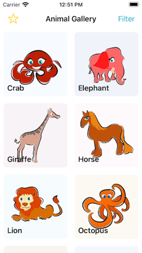
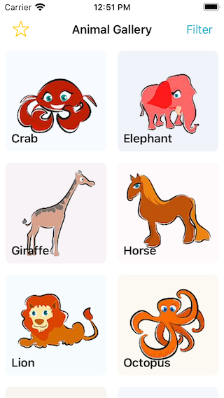

### Automation Animals  
.. a sample application to allow iOS Developers, SEiT, Automation Engineers, Testers to practice implementing XCUITests  

### About
Automation Animals is an application that lets you select animals, view details and mark animal(s) as favorites  
Included within the application are some of the basic features of Product/Details applications i.e. filters and favoriting  
Future roadmap items for this application could see Searching added .. but we would want to see a more robust test suite to prevent too much technical debt.  

### Application
Automation Animals has **3 View Controllers**:  
- Animals Gallery View Controller
- Animal Detail View Controller
- Filtering View Controller

**Animals Gallery View Controller**  
Is the Primary view controller of the application.  
It’s main area is a collection view that presents unto 12 animal (1 per collection view cell)  
Users are able to Filter the animals  
Users are able to display only the favorited animals (allowing for any applied filter)  
Users can Tap on an animal cell and it will navigate them to the Animal Detail View Controller   
_Developer note: Animals Gallery View Controller demonstrates the newer ‘DiffableDataSource and CompositionalLayout’ approach to collection views_

**Animal Detail View Controller**  
The user can navigate to this view controller from tapping a cell on the previous Animal Gallery View Controller  
The user is presented with a larger image, animal name, animal filter tags and a button to toggle Favorite state  

**Filter View Controller**  
This is a simple tableview based view controller, presenting a list of unique strings (tags)  
The tableview is configured for multiple selection  
The view controller can be configured with list of tags and list of selected tags  
Users can select or deselect a tag by tapping on any cell  
It communicates tag selection via a delegate method  
_Developer note: Filter View Controller demonstrates the more traditional datasource/delegate approach to tableview_

**Favorite Animal(s)**  
An animal can have two states, **Favorited** or **Not-favorited**.  
The only visual difference is that a Favorited animal’s image will contain a small yellow filled star

### Challenge
The challenge for you is to integrate XCUITests into the application to verify the UI presentation accurately represents various User Journeys

### User Journeys:
**First Launch**
- As a user entering the app for the first time (favorites is Off and no filters applied) I see all animals (12) in the Gallery and am able to select each one .. upon selection, the user is taken to the animal detail view and presented with information for the selected animal and the favorite button is green and available to tap
- As a user entering the app for the first time (favorites is Off and no filters applied). When the User taps Favorites star (Gallery View Controller) then all animals disappear and a message saying “No animals found” appears

**Favoriting**
- As a user I am able to select an animal from the Gallery, and mark them as favorite. Once favorited, a little star is presented on the animal image (both Gallery and Detail).
- As a user with some favorites added. When the User taps Favorites star (Gallery View Controller) only animals that have been favorited appears in the grid (collection view). Tapping on a favoried animal should navigate to Details View Controller presenting the correct information

**Filtering**
- As a user I am able to Filter the animals based on various Tags (Strings). When a filter is applied, the animals presented in the grid (collection view) changes. Tapping on a filtered animal should navigate to Details View Controller presenting the correct information
- As a user with some Filters applied, I can open the Filter View Controller again and see the existing selection in the multiple selection table view
- As a user with some Filters applied, I can clear all filters
_note: Filter is done based on **OR** filtering_

* * *

###### Screenshot

_Image source_
*Cartoon Animals*  
[stockfreeimages.com](https://www.stockfreeimages.com/16426937/Cartoon-animals.html)
